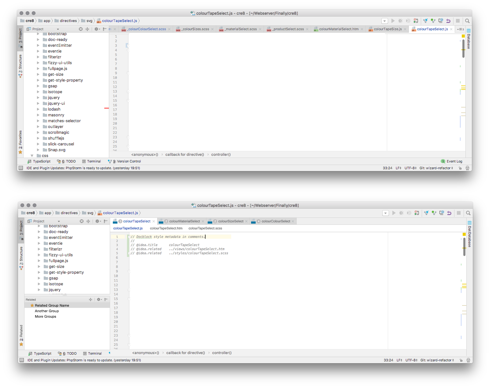

# A Proposal For PHPStorm

When working on most modern development frameworks based upon the MVC design pattern it is common to have to work on files in groups.

Modern Javascript frameworks, such as Ember, Vue, Angular, etc. will often have multiple files in different places but for the same component. For example you may have a Controller, Template, Model and Stylesheet all forming once component.

There are two main usability issues that arise from this situation. The first is that it is difficult to find and open all of the component files, requiring a hunt around the filesystem. The other issue is that the tab bar becomes crowded very quickly.

 ## Proposal - Tab Groups
 
I would like to make a proposal that would add second tab level under each file, based upon relations, using the following rules:
 
 * Relations would be provided via content metadata, e.g. `@idea.related: ../relative/path/to/file.js`
 * Any relationship would be automatically reciprocal.
 * Related files would be displayed in a second level of tabs.
 * Clicking on a related file in the second level would open it within the second tab level.
 * Double clicking would open it as a new file within the primary tab row.
 * The primary tab row would feature a number prefixing the filename, indicating how many related files it had.
 
As a further proposal to the initial, I would also suggest:
 
 * Adding in a futher meta tag, `@idea.title: Group Title Here` which would replace the filename at the top with the specified title.
 * Allow the viewing and searching of these groups in the symbols (⌘ + ⌥ + O) menu.
 * Adding a side panel, similar to Structure, which contains discovered groups.
 
 
 
 
 